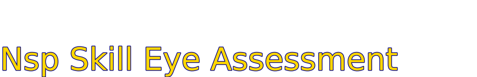

    
# Nsp Skill Eye Assessment 

## Ski Patrol Skill for performing a Pupil assessment and asessing eye movement. 

    

    

## Assessing Pupils

**Objective**: To demonstrate the proper assessment of pupil function.

**Skill Steps**:

1. **Scene Safety and Precautions**:
   - Ensure the scene is safe.
   - Initiate standard precautions (e.g., gloves).
   - Introduce yourself and obtain the patient’s permission to provide assistance.

2. **Pupil Assessment**:

   - **Instruct the Patient**:
     - Ask the patient to focus on your nose or the center of your forehead.
   
   - **Observe Pupil Size**:
     - Check if the pupils are the same size. Note any asymmetry if they appear unequal.
   
   - **Light Reaction Test**:
     - Approach from the side of the patient’s face and briefly shine a light into the left pupil, then move the light away.
     - Observe the reaction of both pupils. Both should constrict (get smaller) when the light is shined into the left eye.
   
   - **Repeat on the Right Eye**:
     - Shine the light into the right pupil and observe as before. Both pupils should again constrict.
   
   - **Document Findings**:
     - Note that pupils are “Equal, Round, and Reactive to Light (PERRL)” if both pupils constrict symmetrically when exposed to light.

This streamlined format clearly outlines the steps and criteria for effective pupil assessment.

### Eye Movement Assessment

**Objective**: To demonstrate the proper assessment of eye movement.

**Skill Steps**:

1. **Scene Safety and Precautions**:
   - Ensure the scene is safe.
   - Initiate standard precautions (e.g., gloves).
   - Introduce yourself and obtain the patient’s permission to provide assistance.

2. **Eye Movement Assessment**:

   - **Instruct the Patient**:
     - Ask the patient to focus on your nose or the center of your forehead.
   
   - **Position Your Finger**:
     - Hold your index finger approximately 6-8 inches away from the patient’s face. Instruct the patient to follow the tip of your finger with their eyes, without moving their head.
   
   - **Horizontal Movement**:
     - Slowly move your finger from the center to the right, back to the center, then to the left, and back to the center again. Observe if the patient’s eyes follow your finger smoothly and in sync with each other.
   
   - **Vertical Movement**:
     - Move your finger from the center upward, then downward past the center, and back up to the center. Ensure the patient’s eyes track the movement smoothly and remain coordinated.
   
   - **Convergence Test**:
     - Move your finger toward yourself a few inches and then slowly bring it closer to the patient’s nose. Check that the patient’s eyes follow your finger and converge appropriately.

    

    
## Getting Started

The goal of this solution is to **Jump Start** your development and have you up and running in 30 minutes. 

To get started with the **Nsp Skill Eye Assessment** solution repository, follow these steps:
1. Clone the repository to your local machine.
2. Install the required dependencies listed at the top of the notebook.
3. Explore the example code provided in the repository and experiment.
4. Run the notebook and make it your own - **EASY !**
    
## List of Figures
             
    

## Github https://github.com/JoeEberle/ - Email  josepheberle@outlook.com 
    

    